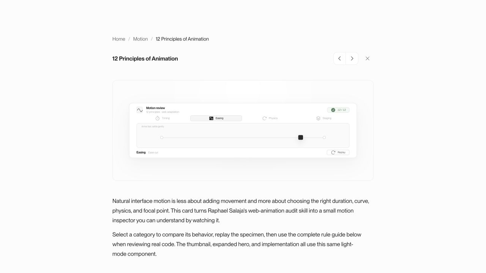
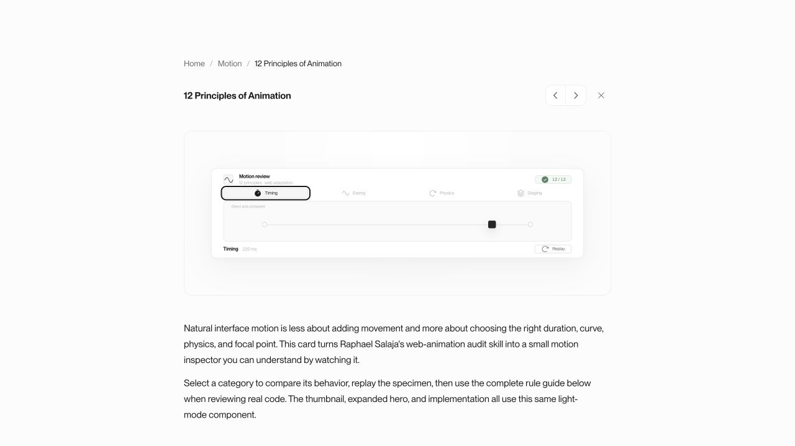
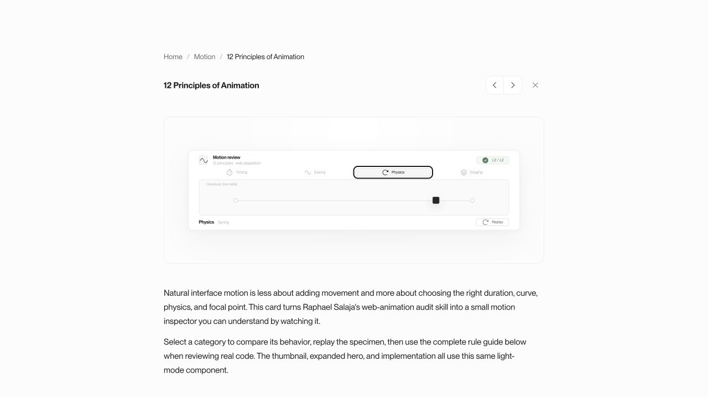
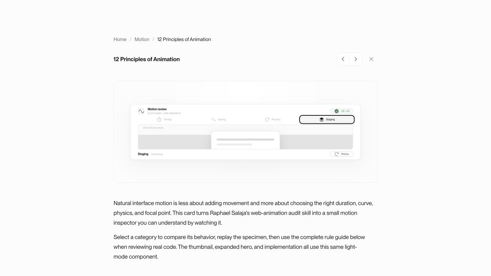
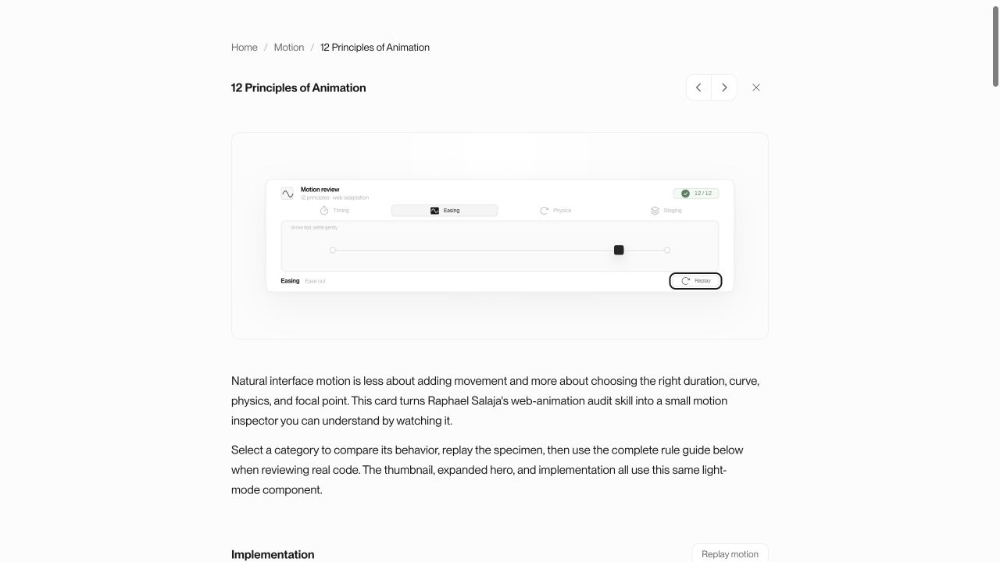
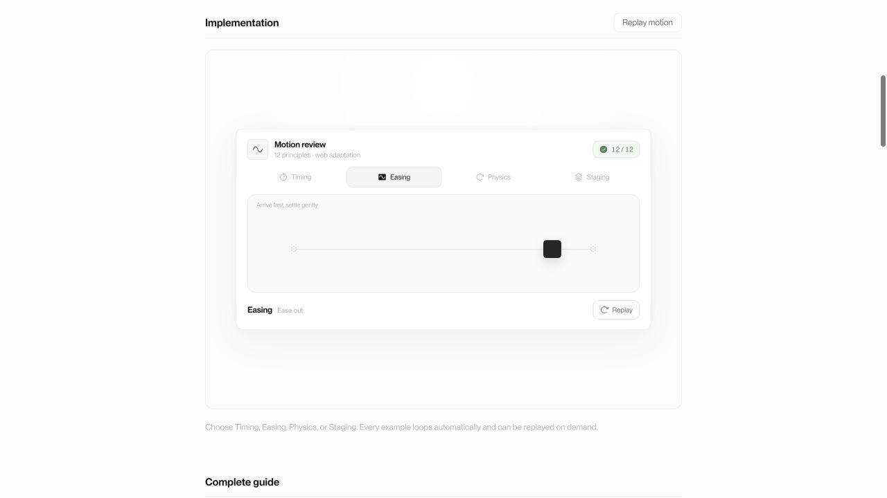

# Animation Principles Source Audit — 2026-07-15

## Audit scope

- Surface: `/vault/animation-principles`, including the compact hero and full implementation.
- User goal: understand and try every rule in the upstream animation-audit skill without leaving the vault.
- Accessibility target: keyboard-operable, motion-safe controls with clear state changes and usable targets.
- Source of truth: [`raphaelsalaja/skill/skills/12-principles-of-animation/SKILL.md`](https://github.com/raphaelsalaja/skill/blob/dc9eef22f13635df77d9b9e67c82aa85d52a97b7/skills/12-principles-of-animation/SKILL.md) at commit `dc9eef22f13635df77d9b9e67c82aa85d52a97b7`.
- Source integrity: current GitHub `main` is still that commit. The upstream and local `SKILL.md` files have the same SHA-256: `2027056a645c5ffdf17047d0e74b78a60c414d91da45d983ffd452548ee1e1ac`.
- Audit mode: combined source-compliance, UX, and accessibility audit. No runtime code was changed.

## Important source clarification

The GitHub skill does not expose twelve individually named Disney principles. It defines **four rule categories** containing **fourteen concrete audit rules**:

- Timing: 3 rules
- Easing: 4 rules
- Physics: 4 rules
- Staging: 3 rules

The current UI exposes one generic animation per category, not one demonstration per rule. The correct source-faithful model is therefore fourteen rule-level options grouped by four category filters—not four options, and not a hard-coded `12 / 12` success score.

## Captured flow

### Step 1 — Default Easing state · Poor

The surface opens with Easing selected. The score already claims `12 / 12`, even though no audit has run and the upstream source contains fourteen rules.

### Step 2 — Timing state · Poor

Timing and Easing use the same rail and token with only a small label/duration change. The visual result does not explain `timing-consistent` or `timing-no-entrance-context-menu`.

### Step 3 — Physics state · Failing

The visible overshoot is generated by a 620 ms CSS keyframe animation. The source requires user-triggered animation under 300 ms and a real spring when overshoot-and-settle is needed.

### Step 4 — Staging state · Partial

The dimmed backdrop and single focal dialog communicate two staging rules, but the backdrop and dialog have no explicit z-index hierarchy.

### Step 5 — Replay control and state machine · Failing

The screenshot identifies the audited replay surface. Code and computed-timing inspection show that Replay sets the active state to false, then restores it after 90 ms. The token and dialog exit transitions take 180–240 ms, so replay reverses them before the exit completes. The automatic 2.4 s interval and manual replay use the same state/timers, which makes the interruption repeat and can compound when the user clicks near an interval tick.

### Step 6 — Full implementation · Poor

The larger implementation is readable, but it still exposes only the same four category-level examples. The fourteen source rules are available only as static text farther down the page.

## Source-rule findings

### High priority

- `src/demos/AnimationPrinciplesDemo.tsx:5 - [source-coverage]` The interactive data model contains four categories rather than the fourteen concrete GitHub rules. Users cannot select or observe ten source rules at all.
- `src/demos/AnimationPrinciplesDemo.tsx:100 - [source-coverage]` The subtitle says “12 principles” and the score at line 102 claims `12 / 12`, but the source defines fourteen audit rules and the UI performs no audit. This is misleading status, not a measured result.
- `src/demos/AnimationPrinciplesDemo.css:219 - [timing-under-300ms]` The user-triggered Physics animation runs for 620 ms, more than twice the upstream 300 ms ceiling.
- `src/demos/AnimationPrinciplesDemo.css:223 - [physics-spring-for-overshoot]` Overshoot is approximated with four CSS keyframes. The source explicitly requires a spring, rather than a duration/easing approximation, when overshoot-and-settle is intended.

### Medium priority

- `src/demos/AnimationPrinciplesDemo.tsx:62 - [easing-exit-ease-in]` Replay restores the entrance state after 90 ms, before the 180–240 ms exit transitions can finish. Timing/Easing tokens and the Staging dialog reverse mid-exit instead of completing an ease-in departure.
- `src/demos/AnimationPrinciplesDemo.css:206 - [easing-exit-ease-in]` The same ease-out transition is used in both directions for Timing and Easing. There is no direction-specific ease-in exit.
- `src/demos/AnimationPrinciplesDemo.css:254 - [staging-z-index-hierarchy]` The backdrop and animated dialog rely on DOM order and both use `z-index: auto`. The source explicitly flags missing z-index on animated overlays as a failure.
- `src/demos/AnimationPrinciplesDemo.tsx:105 - [a11y-tab-pattern]` The component uses `role="tab"` but provides no ArrowLeft, ArrowRight, Home, or End behavior and no roving `tabIndex`. Browser testing confirmed ArrowRight leaves Easing selected and all four tabs remain separate tab stops.
- `src/demos/AnimationPrinciplesDemo.css:335 - [a11y-target-size]` Container scaling reduces compact hero controls to 16 px-high tabs and a 14 px-high Replay button. The full implementation is only 30/28 px high. The controls are visually and physically too small for reliable touch or low-precision input.
- `src/demos/AnimationPrinciplesDemo.css:363 - [reduced-motion-state]` Reduced motion removes the Physics animation, but there is no static active transform for Physics. That state remains at the origin and stops communicating overshoot/settle behavior.

### Lower priority

- `src/demos/AnimationPrinciplesDemo.tsx:13 - [demo-differentiation]` Timing and Easing share the same specimen and nearly identical travel. Their small label and duration changes do not make the rule difference self-explanatory.
- `src/demos/AnimationPrinciplesDemo.tsx:85 - [interaction-timing]` Automatic replay continues on a fixed interval even after manual interaction. Manual replay does not suspend or restart the interval from a clean user-controlled timeline.

## Complete upstream rule matrix

| Upstream rule | Current status | Evidence |
|---|---|---|
| `timing-under-300ms` | Fail | Physics runs 620 ms. |
| `timing-consistent` | Pass | Similar tab/replay control transitions are consistent within their component classes. |
| `timing-no-entrance-context-menu` | Not represented | There is no context-menu example. |
| `easing-entrance-ease-out` | Pass | Token and dialog entrances use ease-out-like curves. |
| `easing-exit-ease-in` | Fail | Exits reuse ease-out and are reversed after 90 ms. |
| `easing-no-linear-motion` | Pass | Spatial motion does not use linear easing. |
| `easing-natural-decay` | Not represented | There is no decay/audio example. |
| `physics-active-state` | Pass | Tabs and Replay scale to 0.97 while active. |
| `physics-subtle-deformation` | Pass | Physics deformation stays within 0.97–1.035. |
| `physics-spring-for-overshoot` | Fail | CSS keyframes approximate a spring. |
| `physics-no-excessive-stagger` | Not represented | There is no stagger example. |
| `staging-one-focal-point` | Pass | Only one token or dialog is prominent. |
| `staging-dim-background` | Pass | Staging adds a non-transparent backdrop. |
| `staging-z-index-hierarchy` | Fail | Backdrop/dialog have no explicit z-index. |

## Summary table

| Rule / audit area | Count | Severity |
|---|---:|---|
| `source-coverage` | 2 | HIGH |
| `timing-under-300ms` | 1 | HIGH |
| `physics-spring-for-overshoot` | 1 | HIGH |
| `easing-exit-ease-in` | 2 | MEDIUM |
| `staging-z-index-hierarchy` | 1 | MEDIUM |
| `a11y-tab-pattern` | 1 | MEDIUM |
| `a11y-target-size` | 1 | MEDIUM |
| `reduced-motion-state` | 1 | MEDIUM |
| `demo-differentiation` | 1 | LOW |
| `interaction-timing` | 1 | LOW |

## Recommended correction order

1. Replace the four-item demo model with all fourteen GitHub rules, retaining Timing/Easing/Physics/Staging as filters or grouped navigation.
2. Replace the fixed `12 / 12` badge with honest source/progress text such as `14 rules`, or calculate a real audit score only after an audit runs.
3. Build a deterministic replay state machine: complete exit first, then enter; pause automatic cycling after user input; never reverse a 180–240 ms exit after 90 ms.
4. Replace the 620 ms keyframe approximation with a real damped-spring simulation and keep direct feedback within the upstream 300 ms requirement.
5. Add explicit backdrop/content z-index tokens and a static reduced-motion Physics state.
6. Implement a complete keyboard tab pattern and preserve at least a 44 px hit area, even when the visible compact control is smaller.
7. Give every rule a distinct, self-explanatory specimen so users can understand the difference without reading the source file.

## Evidence limits

- The audit verified current desktop-rendered states, computed durations/transforms/opacities, keyboard ArrowRight behavior, tab-stop structure, target dimensions, browser logs, and source-file hashes.
- Reduced-motion behavior was audited from the source code because the current in-app browser surface did not expose media-feature emulation.
- Screenshots alone cannot establish full assistive-technology support or WCAG compliance.
