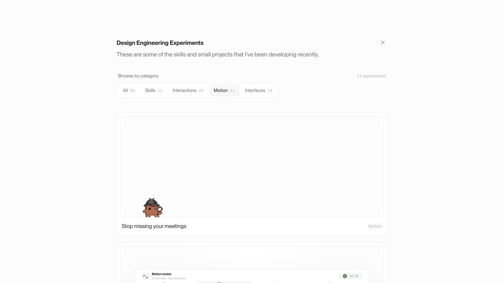
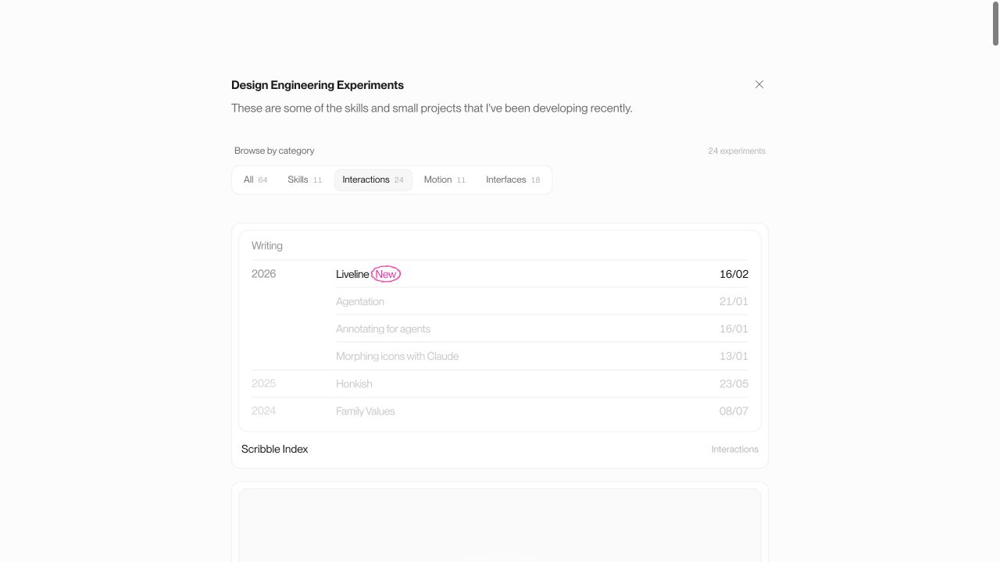
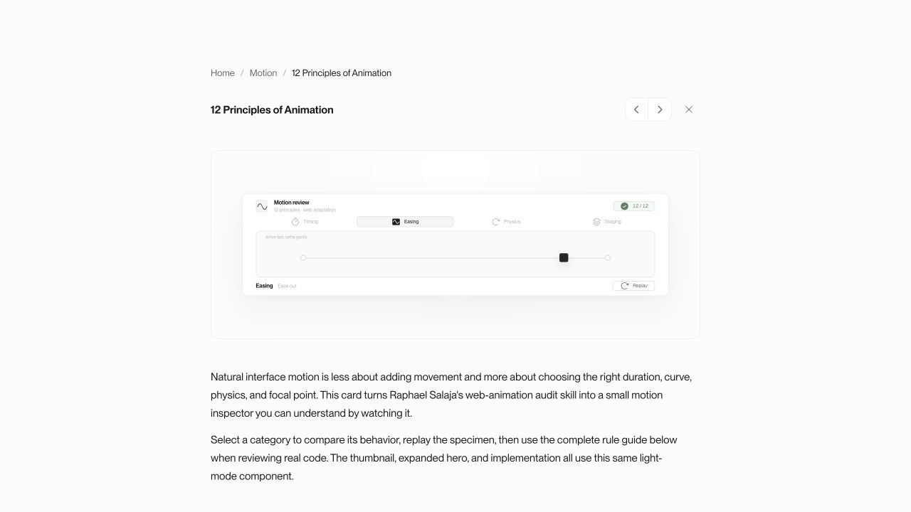
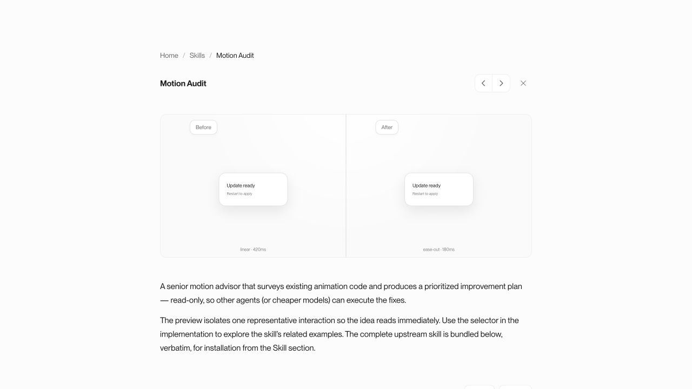
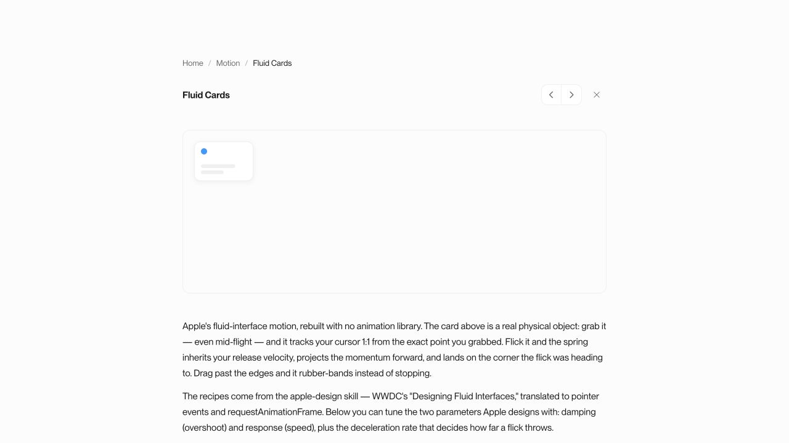

# Vault animation audit — Easing Blueprint

Date: 2026-07-16  
Reference: https://animations.dev/learn/animation-theory/the-easing-blueprint

## Outcome

All 64 registered cards were source-audited, with focused runtime checks on the complete feed, Motion and Interactions filters, the Animation Principles card, the Motion Audit before/after specimen, and Fluid Cards.

| Result | Cards | Meaning |
| --- | ---: | --- |
| Aligned | 36 | The curve matches the motion role, including justified continuous linear loops and spring-driven direct manipulation. |
| Tune | 18 | The card works, but one curve, duration, dependency-owned behavior, or reduced-motion path should be brought into the blueprint. |
| N/A | 10 | The card is static or uses only immediate/gentle state changes; there is no meaningful spatial easing to judge. |

Category totals:

| Category | Aligned | Tune | N/A | Total |
| --- | ---: | ---: | ---: | ---: |
| Skills | 11 | 0 | 0 | 11 |
| Interactions | 14 | 9 | 1 | 24 |
| Motion | 7 | 4 | 0 | 11 |
| Interfaces | 4 | 5 | 9 | 18 |
| **Total** | **36** | **18** | **10** | **64** |

## Blueprint used

- Use `ease-out` for responsive entrances and most UI exits.
- Use `ease-in-out` or a real spring for an element already on screen that moves or morphs.
- Avoid `ease-in` for UI/spatial motion because its slow start reads as delayed.
- Reserve `linear` for constant/time-based motion: progress, spinners, marquees, shimmer travel, and continuous rotation.
- Use `ease` for gentle hover, color, background, and opacity transitions.
- Direct manipulation should track the pointer 1:1; use a spring or deceleration after release, not a filtering tween during the gesture.

## Priority findings

### P1 — Choose one canonical exit rule

`src/pages/AnimationPrinciplesDetail.tsx:45-47` teaches `ease-in` for exits, while the selected Easing Blueprint says to avoid `ease-in` and notes that `ease-out` works well for most UI exits. The live visual specimen itself uses a good ease-out curve; the conflict is in the card's guide and checklist. Because this card teaches the rest of the vault how to animate, it should be reconciled first.

### P1 — Meeting Overlay ignores reduced motion

`src/demos/OverlayDemo.tsx:176-237` keeps the canvas walk/pop/dismiss loop running without checking `prefers-reduced-motion`. The linear walking leg is justified constant-speed locomotion, but the continuous loop needs a reduced-motion settled/static mode like the other motion cards.

### P2 — Two user-triggered exits use an ease-in curve

- `src/demos/transitions/TransitionDemo.css:491-503`: Panel Reveal closes with `cubic-bezier(0.4, 0, 1, 1)` over 350 ms. This is a true ease-in curve and reads as delayed.
- `src/demos/transitions/TransitionDemo.css:717-721`: Input Clear sends each word out with the same ease-in family over 500 ms plus stagger. This is the strongest runtime mismatch with the blueprint.

### P2 — Direct manipulation is filtered by a 400 ms tween

`src/demos/transitions/TransitionDemo.css:905-914` applies a 400 ms ease-out transition to the 3D card while pointer movement updates its rotation. That makes the object trail the pointer. The pointer phase should be transition-free; only release/recenter should use a spring or ease-out.

### P2 — Long on-screen reflows use an entrance curve

- `src/demos/ScrollgalleryDemo.css:147-150`: the already-visible cover rail moves for 620 ms with an expo ease-out.
- `src/index.css:133-146`: Road Cup Knockout reflows for 500 ms with the same expo ease-out.

Both are on-screen spatial moves, so the blueprint points to `ease-in-out` or a spring. They should also be shortened enough that repeated navigation does not feel queued.

### P2 — The global category indicator uses the wrong motion role

`src/App.tsx:145-152` moves and resizes the already-visible category pill with an ease-out curve. This is high-frequency navigation; a 200–250 ms ease-in-out curve would match the blueprint more closely.

### P3 — Consistency pass for on-screen morphs

These cards use a good custom ease-out curve, but the animated object is already present and changing position/shape, so they are candidates for the shared ease-in-out token: Card resize, Text states swap, Page side-by-side, Icon swap, Tabs sliding, Dropdown menu morph, Accordion, Thinking + Reasoning, Web Search, and To-do List. Carousel is dependency-owned by Embla and should receive one measured runtime curve check before changing it.

## Per-card matrix

### Skills

| Card | Result | Audit note |
| --- | --- | --- |
| Design Engineering Taste | Aligned | Fast press feedback and gentle color transitions use appropriate ease/ease-out roles. |
| Animation Vocabulary | Aligned | Entrances use energetic ease-out/spring curves; shimmer is a justified constant linear pass. |
| Motion Audit | Aligned | The slow linear motion is explicitly the “Before” example; the “After” uses 180 ms ease-out. |
| Animation Opportunities | Aligned | Counter/disclosure entrances settle with the shared ease-out curve. |
| The Craft Bar | Aligned | Small review feedback uses gentle opacity and fast ease-out movement. |
| Fluid Interfaces | Aligned | Direct manipulation and interruption use spring behavior rather than a fixed tween. |
| Interface Craft Guidelines | Aligned | Copy/hover feedback is short and gentle; reduced motion is present. |
| Playwright CLI | Aligned | Continuous status pulse uses ease-in-out; controls use short gentle easing and reduced motion. |
| Cohesive Color Systems | Aligned | The linear hue cycle is continuous/time-based and therefore justified; reduced motion stops it. |
| Typography Skills | Aligned | Ambient breathing is sinusoidal; scrubbing is 1:1 and reduced motion holds a settled state. |
| Better UI | Aligned | Shared controls use the vault's fast ease-out token and motion-reduce fallbacks. |

### Interactions

| Card | Result | Audit note |
| --- | --- | --- |
| Scribble Index | Aligned | Drawing is direct; the 140 ms ease transitions are limited to gentle text/color fading. |
| Toast Notifications | Aligned | Sonner intentionally uses `ease` for elegant stacking and ease-out for removal; spinner is justified linear. |
| Carousel | Tune | Embla owns the spatial curve; no local easing contract is exposed, so it needs one measured runtime check. |
| Button Group | N/A | No meaningful spatial transition. |
| Command | Aligned | Dialog/overlay enter in 100 ms with ease-out; reduced motion disables animation. |
| Notification badge | Aligned | Entrance uses a restrained spring-like overshoot; exit is short and gentle. |
| Menu dropdown | Aligned | Entrance uses a responsive custom ease-out; close is short. |
| Modal open/close | Aligned | Open uses ease-out with a staged scrim; close remains brief. |
| Panel reveal | Tune | Close uses a 350 ms ease-in curve and open lasts 400 ms. |
| Icon swap | Tune | Already-visible icons cross/morph with an entrance-style ease-out instead of ease-in-out. |
| Success check | Aligned | Purposeful spring-like confirmation and path draw; no unjustified linear spatial motion. |
| Avatar group hover | Aligned | Distance falloff uses a spring-like curve suited to on-screen physical response. |
| Error state shake | Aligned | A bespoke damped shake curve matches error feedback. |
| Input clear | Tune | Word exits use 500 ms ease-in plus stagger; the slow start is visible after the click. |
| Tabs sliding | Tune | The already-visible indicator moves with ease-out; use ease-in-out. |
| Tooltip open/close | Aligned | Very short gentle hover transition; no heavy spatial travel. |
| 3D tilt | Tune | Pointer-driven rotation is filtered through a 400 ms tween rather than tracking 1:1. |
| Dropdown menu morph | Tune | An already-visible button changes width/height with an expo ease-out; use ease-in-out or spring. |
| Accordion | Tune | The existing surface expands/collapses with ease-out; use the shared on-screen motion curve. |
| To-do List | Tune | Same accordion-role mismatch as above. |
| Interaction Sounds | Aligned | Sound cues enter with ease-out; the spinner is legitimately linear; reduced motion is comprehensive. |
| Gemini Button | Aligned | Traveling beams/spins are continuous linear effects; send feedback uses custom ease-out. |
| Micro Interactions | Aligned | Icon swaps use a restrained spring, pulse uses ease-in-out, and motion-reduce is present. |
| Interactive Pop-Up | Aligned | Dragging is 1:1; release uses a real velocity-aware spring; reduced motion snaps to state. |

### Motion

| Card | Result | Audit note |
| --- | --- | --- |
| Stop missing your meetings | Tune | Constant-speed walking is a valid linear exception, but the loop has no reduced-motion mode. |
| 12 Principles of Animation | Tune | The specimen is good; the written rule prescribing ease-in exits conflicts with this audit's canonical blueprint. |
| Card resize | Tune | Existing geometry morphs with ease-out; use ease-in-out or a spring. |
| Number pop-in | Aligned | New digits enter with a custom ease-out and restrained overshoot. |
| Text states swap | Tune | A present state changes in place with ease-out rather than ease-in-out. |
| Texts reveal | Aligned | New text enters with expo ease-out; disappearance is a short gentle fade. |
| Shimmer text | Aligned | Linear is correct for continuous gradient travel. |
| Thinking State | Aligned | Entry uses ease-out; shimmer is a justified continuous linear effect. |
| Image Generation | Aligned | Continuous loading sweep is linear; completion resolves with a gentle opacity/filter transition. |
| Streaming Text | Aligned | Character streaming and a stepped caret represent passage of time, so constant timing is appropriate. |
| Fluid Cards | Aligned | Pointer tracking, release velocity, momentum, and landing all use real spring physics with reduced-motion fallback. |

### Interfaces

| Card | Result | Audit note |
| --- | --- | --- |
| Attachment | Aligned | Image hover uses 180 ms ease-out; uploading spinner/shimmer are justified continuous linear loops. |
| Calendar | N/A | Calendar state changes are effectively immediate; no spatial easing to judge. |
| Card | N/A | Static form composition. |
| Chart | N/A | Data selection is immediate; no meaningful spatial transition in the card. |
| Breadcrumb | N/A | Static navigation structure. |
| Bubble | N/A | Static message composition. |
| Page side-by-side | Tune | Two already-present pages translate/crossfade with ease-out; use ease-in-out. |
| Skeleton loader and reveal | Aligned | Pulse uses ease-in-out; content crossfade is gentle rather than spatial. |
| Thinking + Reasoning | Tune | The reasoning rows enter correctly, but the existing disclosure opens/closes with ease-out. |
| Web Search | Tune | Resolved sources are entrances but use generic `ease`; the spatial part should use ease-out. |
| File Diff | Aligned | The new diff and rows enter with a custom ease-out and restrained stagger. |
| Text Response | Aligned | The response enters with a custom ease-out. |
| Inline Citations | N/A | Selection state is immediate. |
| Code Block | N/A | Copy state is immediate; no meaningful spatial animation. |
| Data Table | N/A | Row sorting is immediate. |
| Comparison Table | N/A | Selection highlight is immediate. |
| Scroll Gallery | Tune | The already-visible cover rail uses a 620 ms expo ease-out; use a shorter ease-in-out or spring. |
| Road Cup Knockout | Tune | The already-visible bracket reflows for 500 ms with expo ease-out; use ease-in-out or spring. |

## Runtime evidence

### 1. Motion category — generally healthy

The category contains a mix of justified continuous motion, entrances, and physical springs. The main issues are role consistency in the few already-visible reflows, not widespread misuse of `linear`.

### 2. Interactions category — highest concentration of tuning work

This is the largest category and contains most of the on-screen morph/accordion cases. The cards remain readable and contained; the audit is about feel and timing-role fidelity.

### 3. Animation Principles — visual specimen good, written rule conflicts

The live easing specimen arrives quickly and settles. The expanded guide below it is where the exit-rule conflict lives.

### 4. Motion Audit — intentional bad motion is correctly framed

The linear 420 ms example is not a defect. It is visibly labeled “Before” beside the 180 ms ease-out correction, so the card should stay exempt from automated `linear` warnings.

### 5. Fluid Cards — strongest reference implementation

This is the best model for direct manipulation in the vault: 1:1 dragging, interruptible motion, inherited velocity, and spring settling.

## Accessibility and audit limits

- Reduced-motion coverage is broad across the shared CSS families and the custom spring demos. Meeting Overlay is the clear source-level gap.
- Intentional instructional “Before” states and continuous loaders/shimmers were not counted as easing defects.
- This was a complete source audit of all registered cards plus focused runtime sampling, not a frame-by-frame timing capture of every route. Easing perception can still vary with device refresh rate and input hardware.
- Carousel's motion is owned by Embla, so its final verdict requires a measured runtime trace rather than a CSS-only conclusion.

## Recommended implementation order

1. Reconcile the Animation Principles exit rule and add Meeting Overlay reduced motion.
2. Fix Panel Reveal, Input Clear, and 3D Tilt.
3. Introduce one shared on-screen movement token and apply it to the grouped morph/reflow cards, including the homepage category pill.
4. Shorten and retune Scroll Gallery and Road Cup Knockout.
5. Measure Embla Carousel once before changing dependency-owned behavior.
