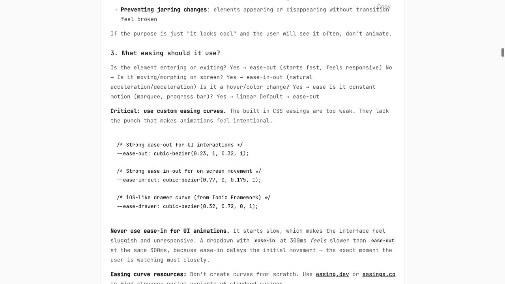
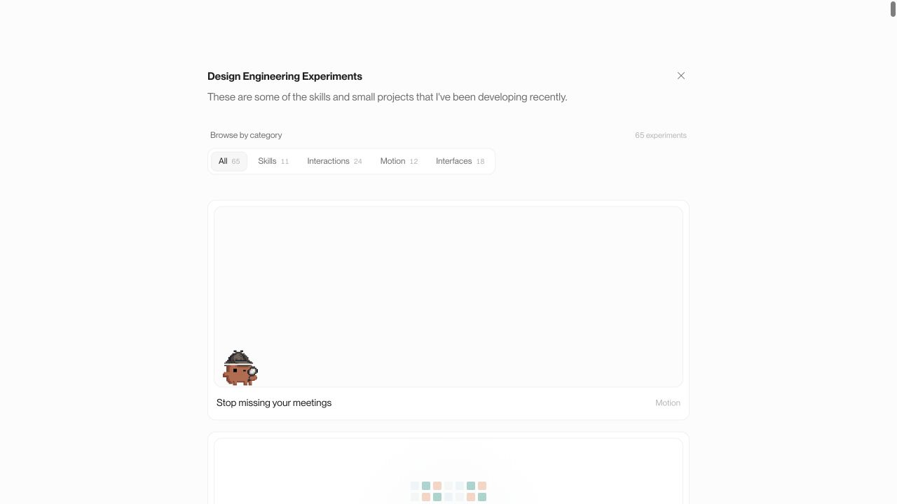
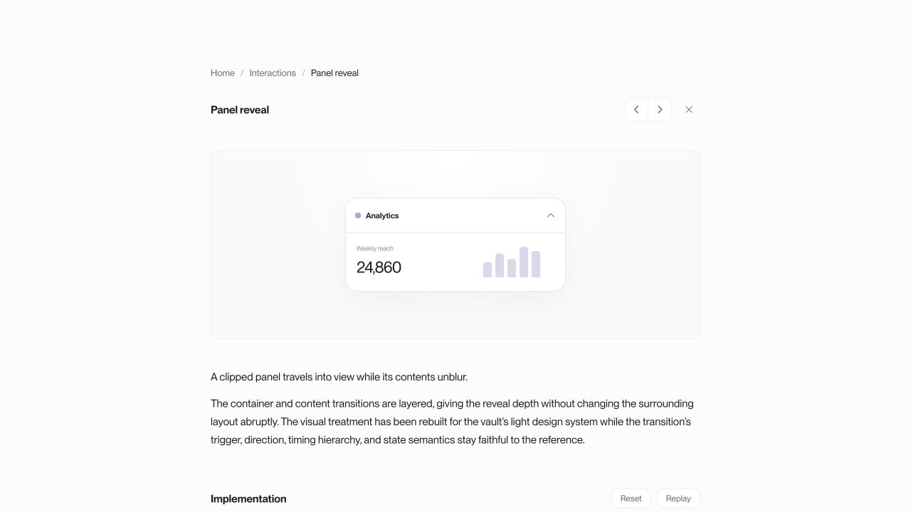
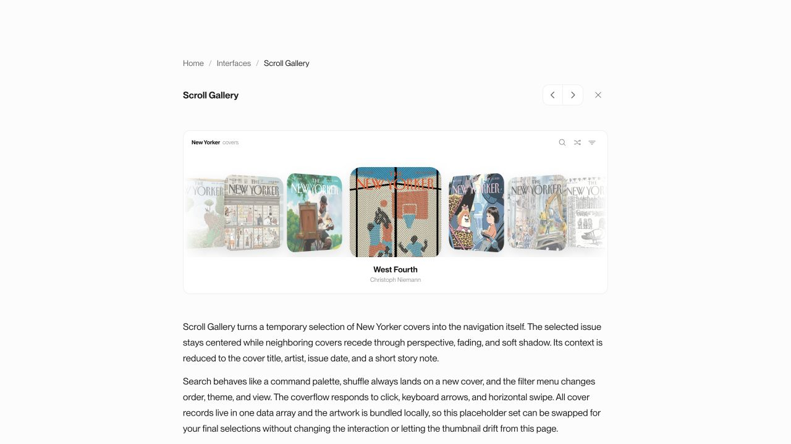

# Vault animation remediation — Easing Blueprint + Emil Design Engineering

Date: 2026-07-16  
Primary reference: https://animations.dev/learn/animation-theory/the-easing-blueprint  
Complementary skill: https://www.ui-skills.com/skills/emilkowalski/emil-design-eng  
Official skill source: https://github.com/emilkowalski/skill/blob/main/skills/emil-design-eng/SKILL.md

## Outcome

The 18 tuning items from the original 64-card audit were implemented and the newly added Gradient Spin card was added to the matrix. The current vault contains 65 registered experiments.

| Result | Cards | Meaning |
| --- | ---: | --- |
| Aligned | 55 | Motion follows the appropriate entrance/exit, on-screen movement, direct-manipulation, spring, gentle-state, or constant-motion role. |
| N/A | 10 | The card is static or effectively immediate, so there is no meaningful spatial easing to judge. |
| Remaining tuning items | 0 | No previously identified P1–P3 item remains open. |

| Category | Aligned | N/A | Total |
| --- | ---: | ---: | ---: |
| Skills | 11 | 0 | 11 |
| Interactions | 23 | 1 | 24 |
| Motion | 12 | 0 | 12 |
| Interfaces | 9 | 9 | 18 |
| **Total** | **55** | **10** | **65** |

## Source integrity and combined decision framework

- The current GitHub source was checked at commit `6bf24434f7730ad169077756cf9c7cd7bd675fc6`.
- The remote source and the vault's bundled `src/content/skills/emil/emil-design-eng/SKILL.md` have the same SHA-256: `433b5a239cda18e0576e4e558532e7e53512e21fafe5b85db4894c28ec399b72`.
- Entering or exiting elements use ease-out; objects already on screen that move or morph use the new `--ease-move: cubic-bezier(0.77, 0, 0.175, 1)` token; hover/color/opacity changes stay on gentle `ease`; perpetual time-based effects stay linear.
- Direct pointer tracking is transition-free. Release/recenter motion may ease or spring.
- Frequent keyboard navigation is immediate. Reduced motion removes spatial movement while keeping the state understandable.
- User-triggered UI motion is kept under 300 ms unless the motion is physical, illustrative, continuous, or deliberately instructional.

## Implemented before/after audit

| Surface | Before | After | Why |
| --- | --- | --- | --- |
| Animation Principles guide | Taught ease-in for exits | Teaches responsive ease-out for exits | Removes the contradiction in the vault's canonical teaching card. |
| Meeting Overlay | Canvas walk/pop loop ignored reduced motion | Reduced motion draws one settled detective and complete notification, without scheduling the loop | Preserves meaning without continuous spatial motion. |
| Panel Reveal | 350 ms ease-in close and 400 ms expo open | 240 ms shared ease-in-out reflow with 180 ms gentle visual changes | The panel already exists on screen; both directions now feel immediate and symmetric. |
| Input Clear | 500 ms ease-in words, 55 ms/item stagger, 220 ms placeholder delay | 160–200 ms ease-out, 28 ms/item stagger, 60 ms placeholder delay | The click now receives immediate feedback and the sequence no longer blocks. |
| 3D Tilt | Pointer rotation was filtered through a 400 ms tween | Pointer phase has no transition; reset/replay uses a 220 ms ease-out | Direct manipulation tracks 1:1 instead of trailing the cursor. |
| Scroll Gallery | 620 ms expo movement and 420 ms fading | 260 ms on-screen curve and 220 ms opacity/filter | Repeated cover navigation is shorter and does not feel queued. |
| Road Cup Knockout | 500 ms expo bracket reflow | 260 ms shared on-screen curve and 180 ms opacity | Existing nodes move as one coherent layout change. |
| Homepage category pill | 250 ms ease-out for every input | 180 ms on-screen curve for pointer input; instant for keyboard input | Pointer navigation remains polished while frequent keyboard switching stays fast. |
| Card resize | 300 ms ease-out geometry morph | 240 ms shared on-screen curve | Width, height, and radius are existing geometry. |
| Text states swap | 360 ms ease-out state change | 220 ms shared on-screen curve | The same text slot morphs between present states. |
| Page side-by-side | 250 ms ease-out translation/crossfade | 220 ms shared on-screen curve with 200 ms visual fade | Both pages are already staged in the same viewport. |
| Icon swap | 250 ms ease-out plus `scale(0.25)` | 200 ms shared on-screen curve plus `scale(0.9)` | Avoids disappearance-from-zero and keeps the icon change subtle. |
| Tabs Sliding | 250 ms ease-out indicator | 180 ms shared on-screen curve; keyboard changes suppress the transition | Matches both motion role and interaction frequency. |
| Dropdown Menu Morph | 300 ms expo width/height/radius | 230 ms shared on-screen curve; content enters with 220 ms ease-out | Separates surface morphing from content entrance. |
| Accordion | 250 ms ease-out disclosure | 220 ms shared on-screen curve | Expansion and collapse are on-screen geometry changes. |
| Thinking + Reasoning | 360 ms ease-out disclosure | 220 ms shared on-screen curve | Keeps the long-running task content readable without a slow shell. |
| Web Search | 320 ms generic ease for new sources | 220 ms ease-out spatial entrance, 200 ms visual resolution | New result rows arrive responsively while color remains gentle. |
| To-do List | 330 ms ease-out disclosure | 220 ms shared on-screen curve | Same disclosure-role correction as Accordion and Reasoning. |
| Carousel | Dependency-owned motion was unresolved | Measured: approximately 84% of one snap distance is covered in the first 45 ms, then Embla settles progressively and remains interruptible | The runtime behavior is responsive physical settling; no local rewrite is warranted. |
| Gradient Spin | Not present in the original 64-card audit | Aligned continuous linear cycle with viewport gating and reduced-motion freeze | Linear timing is correct for a perpetual progress/loading pattern. |

## Complete 65-card disposition

### Skills — 11 aligned

Design Engineering Taste; Animation Vocabulary; Motion Audit; Animation Opportunities; The Craft Bar; Fluid Interfaces; Interface Craft Guidelines; Playwright CLI; Cohesive Color Systems; Typography Skills; Better UI.

### Interactions — 23 aligned, 1 N/A

Aligned: Scribble Index; Toast Notifications; Carousel; Command; Notification badge; Menu dropdown; Modal open/close; Panel reveal; Icon swap; Success check; Avatar group hover; Error state shake; Input clear; Tabs sliding; Tooltip open/close; 3D tilt; Dropdown menu morph; Accordion; To-do List; Interaction Sounds; Gemini Button; Micro Interactions; Interactive Pop-Up.  
N/A: Button Group.

### Motion — 12 aligned

Stop missing your meetings; Gradient Spin; 12 Principles of Animation; Card resize; Number pop-in; Text states swap; Texts reveal; Shimmer text; Thinking State; Image Generation; Streaming Text; Fluid Cards.

### Interfaces — 9 aligned, 9 N/A

Aligned: Attachment; Page side-by-side; Skeleton loader and reveal; Thinking + Reasoning; Web Search; File Diff; Text Response; Scroll Gallery; Road Cup Knockout.  
N/A: Calendar; Card; Chart; Breadcrumb; Bubble; Inline Citations; Code Block; Data Table; Comparison Table.

## Runtime verification

- The feed reports `65 experiments` and preserves the category totals 11 / 24 / 12 / 18.
- Panel Reveal computed styles resolve to `240ms cubic-bezier(0.77, 0, 0.175, 1)` for geometry and 180 ms for opacity/filter/border.
- Input Clear computed styles resolve to 160–200 ms, with the existing vault ease-out curve and shortened delays.
- 3D Tilt reports `data-active=true` under pointer input and a computed card transition of `none`.
- Scroll Gallery successfully changed selection to Plein Air; computed movement is 260 ms with the shared on-screen curve.
- Carousel transform samples after one Next action were `0`, `-279.15`, `-296.67`, `-310.56`, `-318.53`, `-324.67`, `-328.29`, `-330.73`, and `-332.62` px at roughly 45 ms intervals.
- TypeScript passes, `git diff --check` passes, and the production Vite build passes. The existing bundle-size advisory remains non-blocking.

## Captured audit steps

| Step | Capture | General health |
| ---: | --- | --- |
| 1 | `source/01-emil-skill-top.jpg` — official skill identity and installation | Healthy; source and local archive are identical. |
| 2 | `source/02-animation-decision-framework.jpg` — frequency and animation decision tree | Healthy; used to exempt constant/physical/instructional motion. |
| 3 | `source/03-easing-guidance.jpg` — exact easing-role guidance and tokens | Healthy; became the shared on-screen movement contract. |
| 4 | `source/04-reduced-motion.jpg` — reduced-motion and touch guidance | Healthy; exposed Meeting Overlay as the one clear gap. |
| 5 | `source/05-asymmetric-stagger.jpg` — duration, stagger, and exit-response guidance | Healthy; drove the Input Clear timing reduction. |
| 6 | `implementation/01-vault-feed.png` — current feed and category counts | Healthy; 65 experiments render in the existing light system. |
| 7 | `implementation/02-animation-principles.png` — canonical teaching card | Healthy; visual specimen is unchanged and the guide below now teaches ease-out exits. |
| 8 | `implementation/03-panel-reveal.png` — reflow correction | Healthy; contained, readable, and now 240 ms in both directions. |
| 9 | `implementation/04-input-clear.png` — response/stagger correction | Healthy; single focal interaction, no delayed ease-in. |
| 10 | `implementation/05-3d-tilt.png` — direct manipulation correction | Healthy; visual treatment is unchanged and pointer tracking is transition-free. |
| 11 | `implementation/06-thinking-reasoning.png` — disclosure correction | Healthy; compact task hierarchy remains intact. |
| 12 | `implementation/07-scroll-gallery.png` — long rail correction | Healthy; cover artwork, crop, and hierarchy remain unchanged. |
| 13 | `implementation/08-road-cup.png` — bracket reflow correction | Healthy; geometry remains readable with the shorter shared motion. |
| 14 | `implementation/09-meeting-overlay.png` — reduced-motion implementation surface | Healthy in standard motion; reduced-motion behavior was source-verified because the current browser controller does not expose media-emulation controls. |

## Accessibility, strengths, and limits

- Strength: the vault now has a single named curve for already-visible spatial movement instead of scattered near-duplicates.
- Strength: direct manipulation, perpetual motion, instructional “Before” states, and physical springs remain intentionally distinct rather than being flattened into one timing rule.
- Strength: the thumbnail/expanded implementations remain visually synchronized; the audit changed motion contracts, not card layout or content.
- Accessibility: existing family-level reduced-motion rules remain in place, and Meeting Overlay now has a settled canvas state. The new Gradient Spin freezes to a useful phase.
- Accessibility limit: reduced-motion media emulation was not available through the current in-app browser control surface, so the new Meeting Overlay branch was verified by source path and standard-render regression rather than a captured emulated screenshot.
- Perception limit: easing feel can vary with refresh rate and input hardware. The report records computed timing and representative runtime samples, not frame-perfect high-speed video for every route.

Output location: `artifacts/audits/easing-blueprint-fixes-2026-07-16/`

final result: passed
