# Emil Kowalski skills collection — implementation audit

Date: 2026-07-16  
Surface: six Skills feed cards and their expanded pages  
Upstream: `emilkowalski/skills` at `6bf24434f7730ad169077756cf9c7cd7bd675fc6`

## Audit scope

The current local skill archive is accurate: every bundled `SKILL.md` is byte-for-byte identical to the current upstream file. This audit therefore evaluates the vault presentation layer only: thumbnail focus, motion lifecycle, expanded-card exploration, responsive behavior, interaction clarity, and accessibility.

## User goal

Each feed card should communicate one idea immediately:

- one interaction;
- one motion;
- one fluid-interface example; or
- one animation.

The expanded page can expose additional examples and variants through a compact selector.

## Evidence and findings

### 1. Design Engineering Taste — unhealthy

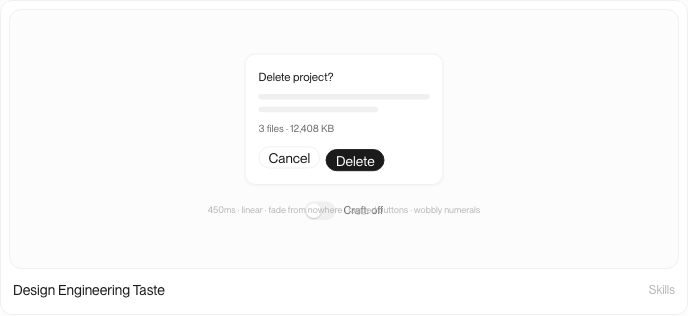

The thumbnail combines a dialog, two actions, a Craft switch, two competing states, and a long technical caption. At compact size the switch and comparison copy overlap. The broad skill is being explained instead of demonstrated.

Fix: make the thumbnail a single responsive “Save changes” button interaction. Move popover origin and tabular-number examples into the expanded selector.

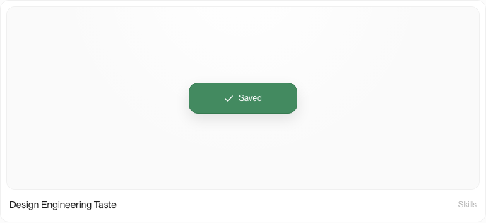

### 2. Animation Vocabulary — needs major revision

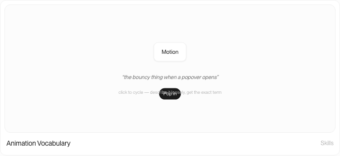

The motion chip is readable, but the vague-description sentence, revealed term, click instruction, and ambient cycling compete for the same center line. The user sees four layers of explanation around one small motion.

Fix: show one named effect at a time. Default to Pop in. The expanded selector can switch between Pop in, Rubber-banding, Stagger, and Shimmer.

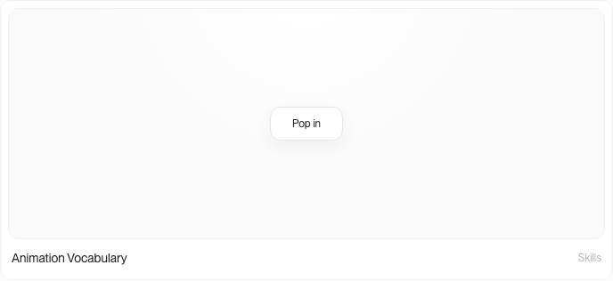

### 3. Motion Audit — unhealthy

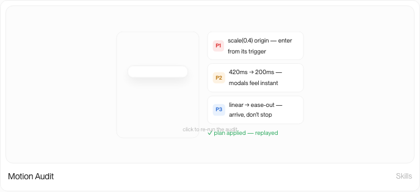

The modal, three priority rows, completion verdict, and replay instruction create a miniature dashboard. The thumbnail is caught at arbitrary phases because its loop starts at page mount rather than when viewed.

Fix: show one corrected modal entrance and one compact audit finding. Put Purpose, Easing, Performance, and Accessibility audits in the expanded selector.

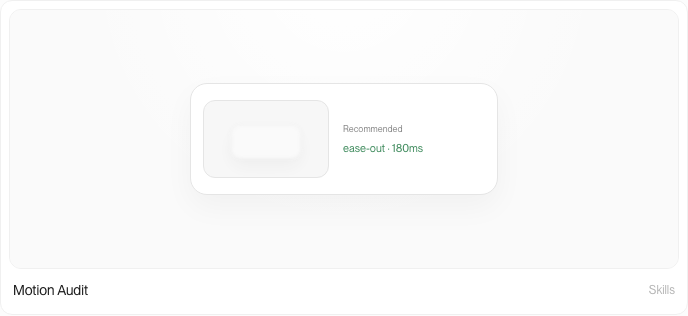

### 4. Animation Opportunities — unhealthy

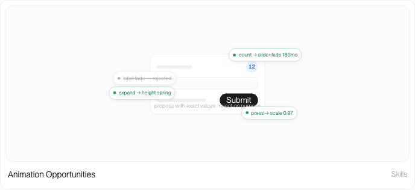

Four floating annotations surround a form, overlap the embedded Submit button, and create multiple simultaneous focal points. The deliberately rejected candidate is valuable, but not alongside three accepted candidates in a thumbnail.

Fix: default to one animated counter opportunity. Put Disclosure, Press feedback, and the deliberately rejected label fade into the expanded selector.

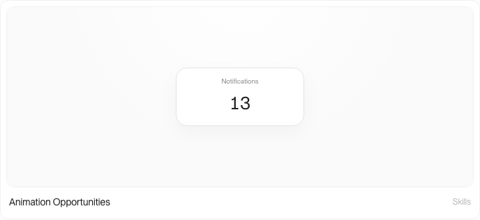

### 5. The Craft Bar — unhealthy

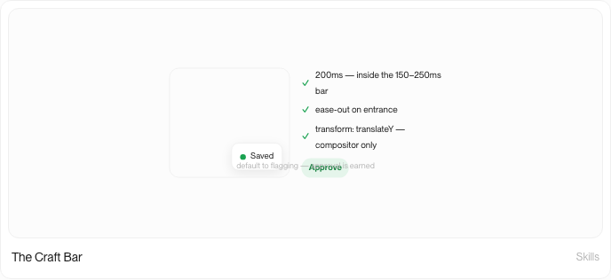

A toast, three standards, explanatory copy, and a verdict compete for attention. The review sequence is conceptually strong but reads as a compressed report, not one motion example.

Fix: show one toast entrance plus one clear Pass result. Put Duration, Easing, Performance, and Interruptibility checks in the expanded selector.

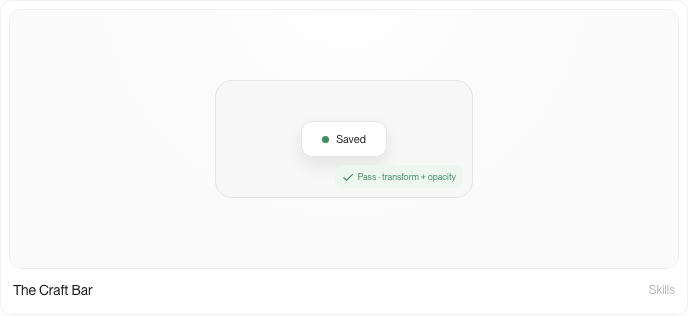

### 6. Fluid Interfaces — structurally sound, visually weak

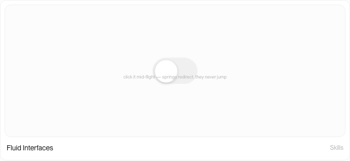

This is the only card already centered on one interaction. Its switch is too small, the instructional caption crosses the control, and its requestAnimationFrame loop continues offscreen.

Fix: enlarge the spring toggle and remove the thumbnail caption. Add Rubber band, Direct drag, and Spatial origin as expanded variants.

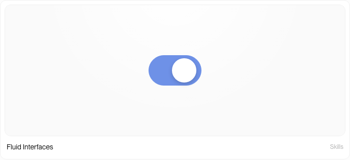

## Collection-wide UX risks

1. `compact` is declared in the component API but ignored, so feed and expanded views render the same information density.
2. Every specimen starts looping when the homepage mounts. Offscreen cards reach arbitrary states before the user sees them and keep timers or animation frames alive.
3. Technical captions are absolutely positioned over interactive content and disappear only at the smallest container threshold.
4. Four cards attach click behavior to generic `div` stages without an equivalent keyboard trigger.
5. The expanded pages repeat the same overloaded specimen instead of using their extra space to expose controlled exploration.

## Accessibility risks

- Several compact instructions render below a practical reading size.
- Clickable stage containers do not expose button semantics or keyboard activation.
- Ambient sequences are not visibility-gated, increasing motion and background work.
- Reduced-motion settles the sequence, but the presentation does not explain that state change to assistive technology.
- Screenshot review cannot confirm full screen-reader output or focus order; those require DOM and keyboard testing after implementation.

## Implemented plan

1. [x] Added a typed catalog containing one default and the related variants for each skill.
2. [x] Made `compact` a real presentation mode with one focal interaction and no report UI.
3. [x] Added a shared visibility observer so compact autoplay starts on entry, resets offscreen, and replays on re-entry.
4. [x] Rebuilt the six specimens around semantic buttons and a keyboard-operable direct-manipulation slider.
5. [x] Added a light native Example selector to every expanded Implementation section.
6. [x] Verified every default thumbnail, all 23 expanded variants, direct interaction, reduced motion, 1440 px, 390 px, and 320 px fit, TypeScript, and the production build.

## Expanded exploration

Every detail page keeps the focused default in its hero and moves the broader skill vocabulary into the Implementation selector.

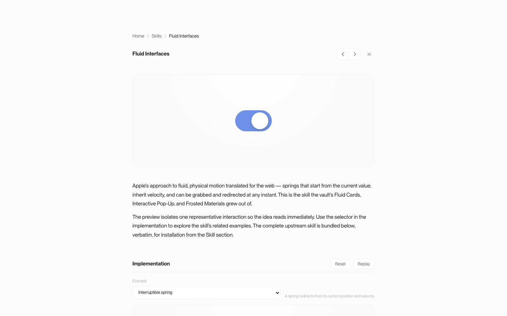

The narrow layout keeps the same hierarchy and no longer clips the shared specimen.

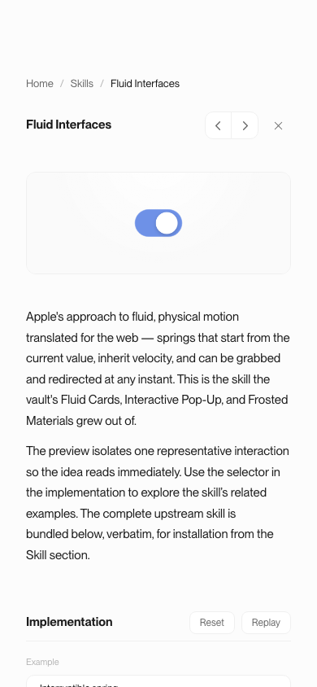

## Verification result

- Six focused feed thumbnails, each with exactly one `.ek-stage`.
- Twenty-three selectable examples across the six expanded pages.
- No legacy compact captions, plans, pins, or multi-row checklists.
- Compact autoplay remains idle offscreen, starts at 35% visibility, resets on leave, and replays on re-entry.
- Reduced motion preserves the meaningful end state without scheduling the ambient loop.
- Direct specimen interaction stays on the feed; the surrounding card and caption still open the detail route.
- All routes pass at 1440 px, 390 px, and 320 px with no horizontal or specimen overflow.
- Browser console, TypeScript, and production build pass. The build retains the repository’s pre-existing large-chunk warning.

## Evidence limits

The screenshots establish visible hierarchy, density, overlap, and state clarity. They do not by themselves prove assistive-technology announcements or reduced-motion behavior; implementation QA must test those separately.
