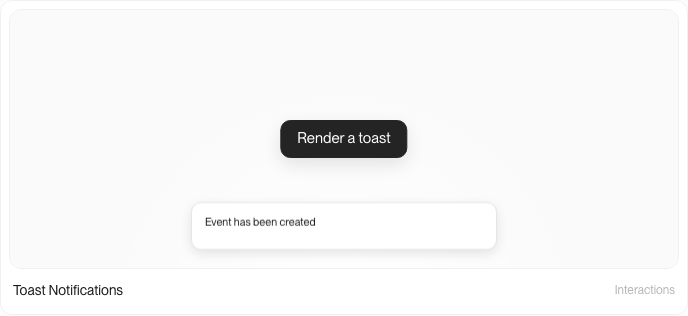
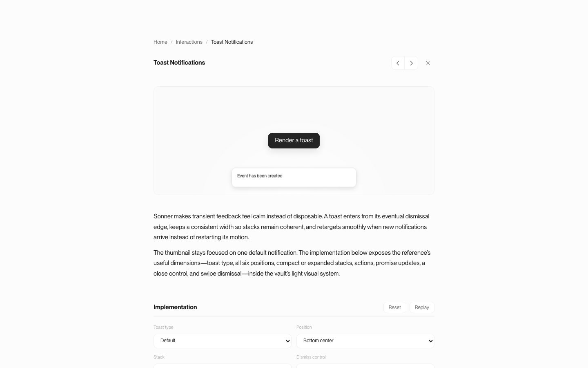
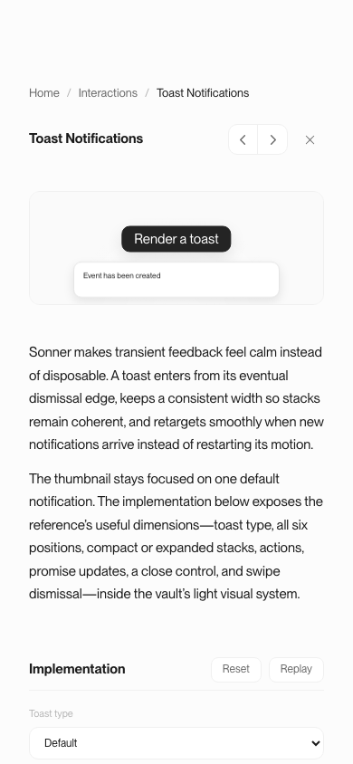

# Toast Notifications — Sonner reference QA

Date: 2026-07-16  
Route: `/vault/sonner`  
Source site: `https://sonner.emilkowal.ski/`  
Source repository: `emilkowalski/sonner` at `45d894085af8ca8421912789a8f5a4ac4ac3d0ea`

## Source behavior retained

- Default, Description, Success, Info, Warning, Error, Action, and Promise toast types.
- Top/bottom plus left/center/right positions.
- Fixed-width stacking with three visible notifications.
- Compact depth steps that expand on hover or focus.
- Smooth 400 ms transition-based entry and stack retargeting.
- In-place promise resolution, action controls, optional close controls, and 45 px swipe dismissal.
- Edge-aware entry and dismissal direction.

## Vault adaptation

- The feed card contains one default toast interaction only.
- Type, position, stack, and dismiss controls live on the expanded page.
- Visuals use the vault’s light surfaces, typography, borders, and compact radii.
- The implementation is local React/CSS and does not add a Sonner runtime dependency.
- Thumbnail autoplay is visibility-gated and reduced motion resolves directly to a settled toast.

## Visual evidence

## Verification

- Desktop: 1440 × 900.
- Mobile: 390 × 844.
- Narrow mobile: 320 × 720.
- Eight toast types and six positions present.
- Promise toast updates from loading to success in place.
- Action and close controls dismiss correctly.
- Stack caps at three, hides back content, and expands on hover.
- Pointer swipe beyond 45 px dismisses the active toast.
- Feed interaction remains on the homepage; the caption opens the detail route.
- Reduced-motion, console, TypeScript, and production build checks pass.
- No horizontal or specimen overflow remains.

Final result: passed.
